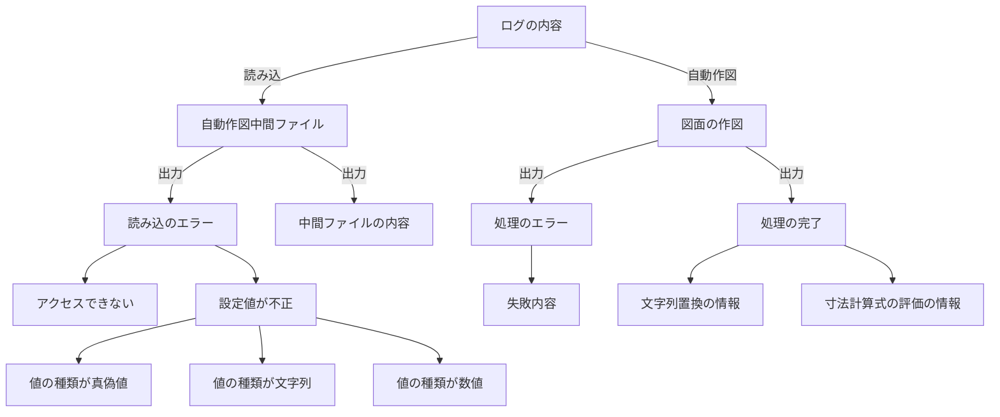
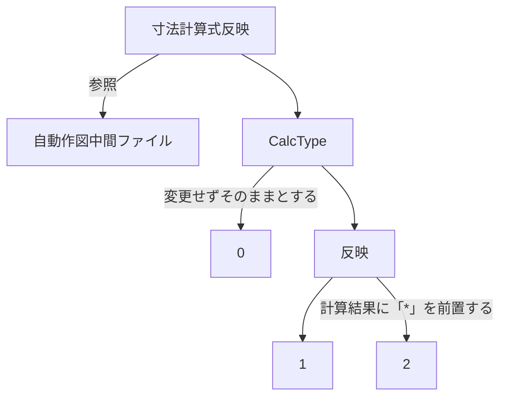
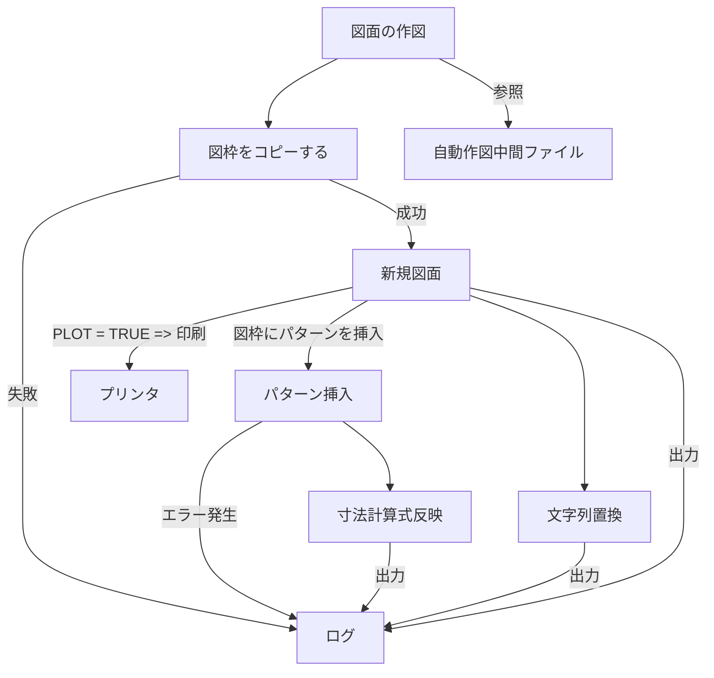

# コマンド パターン
Command （コマンド、 命令） は、 振る舞いに関するデザインパターンの一つで、 リクエストを、 それに関するすべての情報を含む独立したオブジェクトに転換します。

## コマンドパターンのクラス図

### コマンド の役割り
1. Command（命令） 
命令のインターフェース（API）を定義する役です。
1. 具象コマンド （ConcreteCommand）
具体的命令の役。Commandのインターフェースを実際に実装する
1. Receiver	
受信者の役。命令の受け取り手となる
1. Client	
依頼者の役。具体的命令を生成し、命令の受け取り手を割り当てる
1. Invoker	
起動者の役。Commandで定義されているインターフェースを呼び出し、命令の実行を開始する

# サンプルコードの解説
コマンド パターンの説明のため、文字列表示の機能を実装します。

