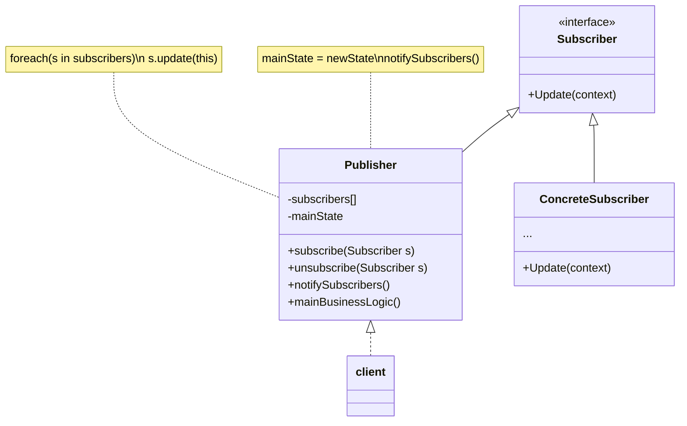

# Observer パターン
観察される側(=Subject)と観察する側(=Observer)の2つの役割が存在し、Subjectの状態が変化した際にObserverに通知されるデザインパターンです。そのため、状態変化に応じた処理を記述する時に有効です。
## Observerパターンのクラス図

### Observer の　役割り
 1. パブリッシャー （Publisher）
 - 他のオブジェクトが関心を持つイベントを発行します。 パブリッシャーがその状態を変えた時や何らかの行為を行なった時に、 このようなイベントが発生します。 パブリッシャーには、 サブスクリプションの仕組みがあり、 新規サブスクライバーの参加や現サブスクラーバーの参加を取り消すことができます。
 - 新しいイベントが発生すると、 パブリッシャーはサブスクリプション・リストにアクセスし、 各サブスクライバー・オブジェクトのサブスクライバー・インターフェースで宣言された通知メソッドを呼び出します。
 2. サブスクライバー （Subscriber） インターフェース
 - 通知用インターフェースを宣言します。 ほとんどの場合、 update メソッド一つだけがあります。 このメソッドには、 更新時にパブリッシャーがイベントの詳細情報を渡せるようにいくつかパラメータを持たせることもできます。
 3. 具象サブスクライバー （Concrete Subscribers） 
 - パブリッシャーが発行した通知に応じて何らかのことを行います。 これらのクラスは、 パブリッシャーが具体的なクラスに結合されずにすむように、 すべて同じインターフェースを実装しなければなりません。
 - 通常、 サブスクライバーは、 更新を正しく処理するために周辺情報を必要とします。 このため、 パブリッシャーは、 通知メソッドの引数として周辺データを渡すことがよくあります。 パブリッシャーは引数として自分自身を渡すことができ、 サブスクライバーは必要なデータを直接取得することができます。
 4. Client （クライアント） 
 - パブリッシャーとサブスクライバーのオブジェクトを別々に作成し、 パブリッシャーの更新に対してサブスクライバーを登録します。

