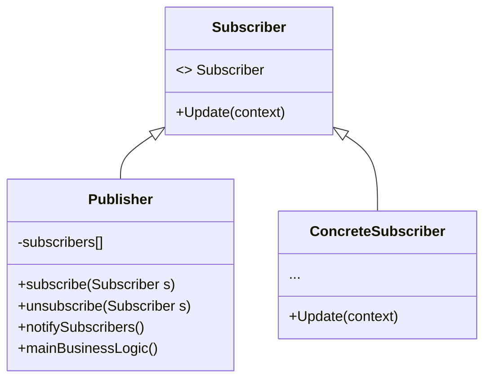

# Observer パターン
観察される側(=Subject)と観察する側(=Observer)の2つの役割が存在し、Subjectの状態が変化した際にObserverに通知されるデザインパターンです。そのため、状態変化に応じた処理を記述する時に有効です。
## Observerパターンのクラス図

### Decorator の　役割り
1. パブリッシャー （Publisher）
他のオブジェクトが関心を持つイベントを発行します。 パブリッシャーがその状態を変えた時や何らかの行為を行なった時に、 このようなイベントが発生します。 パブリッシャーには、 サブスクリプションの仕組みがあり、 新規サブスクライバーの参加や現サブスクラーバーの参加を取り消すことができます。
2. 新しいイベントが発生すると、 パブリッシャーはサブスクリプション・リストにアクセスし、 各サブスクライバー・オブジェクトのサブスクライバー・インターフェースで宣言された通知メソッドを呼び出します。
3. サブスクライバー （Subscriber） インターフェース
通知用インターフェースを宣言します。 ほとんどの場合、 update メソッド一つだけがあります。 このメソッドには、 更新時にパブリッシャーがイベントの詳細情報を渡せるようにいくつかパラメータを持たせることもできます。
4. 具象サブスクライバー （Concrete Subscribers） 
パブリッシャーが発行した通知に応じて何らかのことを行います。 これらのクラスは、 パブリッシャーが具体的なクラスに結合されずにすむように、 すべて同じインターフェースを実装しなければなりません。
5. 通常、 サブスクライバーは、 更新を正しく処理するために周辺情報を必要とします。 このため、 パブリッシャーは、 通知メソッドの引数として周辺データを渡すことがよくあります。 パブリッシャーは引数として自分自身を渡すことができ、 サブスクライバーは必要なデータを直接取得することができます。
6. Client （クライアント） 
パブリッシャーとサブスクライバーのオブジェクトを別々に作成し、 パブリッシャーの更新に対してサブスクライバーを登録します。

