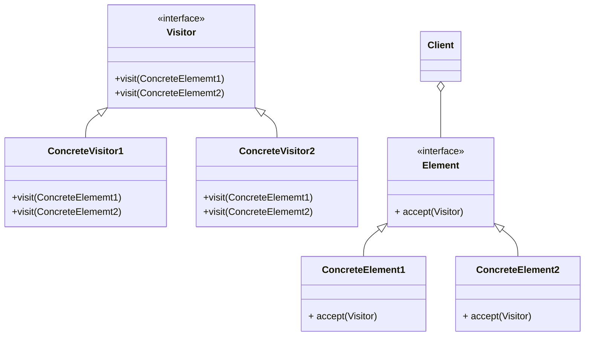

# Visitor パターン
[Visitor] = [訪問者]

このパターンは, [データ構造] と [それに体する処理] を分離することを目的とするパターンである. そのため, このパターンを適用すると, [データ構造] を変更することなしに, [新しい処理] を追加することができる.

具体的には, 訪問者である Visitor 役のオブジェクトが, 訪問先であるデータ構造要素の個々のオブジェクトを訪問し, その訪問先の公開されている資源を利用して処理を実行して回るという形になる. (データ構造役オブジェクトは, 処理を訪問者役オブジェクトに委任する)

## Visitorパターンのクラス図

### Visitor の役割り
1. Visitor (訪問者):
具体的なデータ構造の要素 (ConcreteElement[1|2]) 毎に訪問して行う処理 (visit メソッド) のインタフェースを定義する. visit メソッドは, オーバーロードすることで, その訪問先要素の型に応じた処理を指定する.
2. ConcreteVisitor[1|2] (具体的訪問者):
[Visitor] で定義したインタフェース (各 visit メソッド) を実装する.
3. Element (データ構造 (受入者)):
[Visitor] の訪問先であるデータ構造要素に, 受入口 (accept メソッド) のインタフェースを実装する.
4. ConcretElement[1|2] (具体的データ構造 (受入者)):
[Element] で定義したインタフェース (accept メソッド) を実装する.
5. Client (利用者):
[Visitor] パターンを適用したクラスを用い処理を行う.
