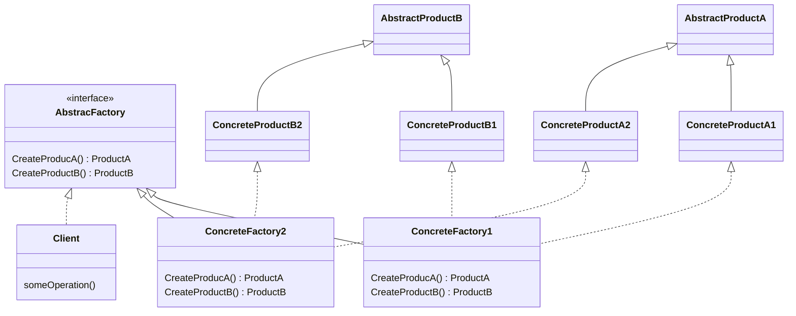

# AbstractFactory パターン
Abstract Factory パターン は互いに関連する一連のオブジェクト群を, その具象クラスに依存しないで生成するためのインタフェースを提供する

## AbstractFactoryパターンのクラス図

## 役割
1. AbstractProduct[A,B] (抽象的な製品):
[AbstractFactory] (抽象的な工場) によって生成される抽象的なオブジェクト (部品, 製品) のインタフェースを定義する.
2. ConcreteProduct[A1,A2], ConcreteProduct[B1,B2] (具体的製品):
AbstractProduct[A,B] のインタフェースを実装する.
3. AbstractFactory (抽象的な工場):
AbstractProduct[A,B] を生成するためのインタフェースを定義する. Factory オブジェクト ConcreteFactory[1,2] (具体的な工場) を生成するためのクラスメソッドを定義する.
4. ConcreteFactory[1,2] (具体的な工場):
[AbstractFactory] のインタフェースを実装する.
5. Client(利用者):
AbstractProduct[A,B], [AbstractFactory] が提供するインタフェースのみを使用して処理を行う.
