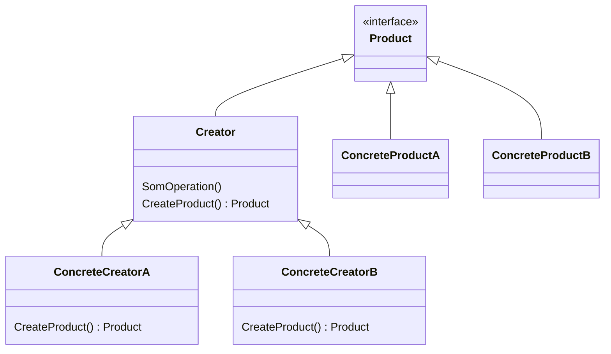

# Factory パターン
Factory Method （ファクトリー・メソッド） は、 生成に関するデザインパターンの一つで、 スーパークラスでオブジェクトを作成するためのインターフェースが決まっています。 しかし、 サブクラスでは作成されるオブジェクトの型を変更することができます。

## Factoryパターンのクラス図

```mermaid
classDiagram
class Creator
Creator: SomOperation()
Creator: CreateProduct() Product
class Product
class Creator
<<interface>> Product
Product  <|-- Creator
Creator  <|-- ConcreteCreatorA
Creator  <|-- ConcreteCreatorB
Product  <|-- ConcreteProductA
Product  <|-- ConcreteProductB
ConcreteCreatorA : CreateProduct() Product
ConcreteCreatorB : CreateProduct() Product
```

