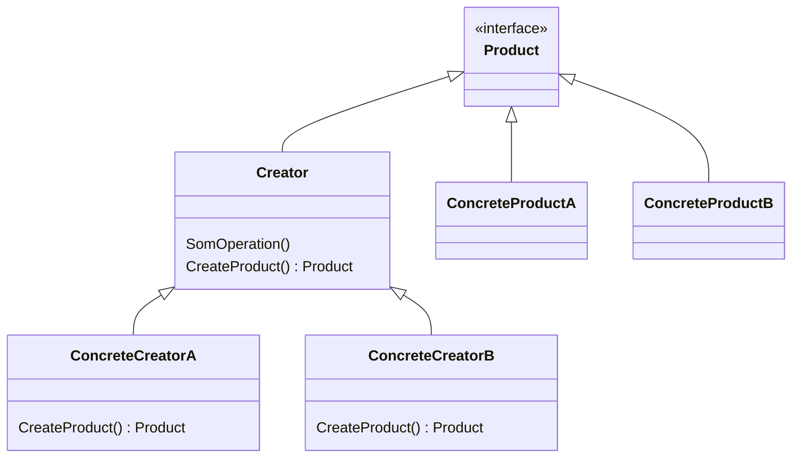

# Factory パターン
Factory Method （ファクトリー・メソッド） は、 生成に関するデザインパターンの一つで、 スーパークラスでオブジェクトを作成するためのインターフェースが決まっています。 しかし、 サブクラスでは作成されるオブジェクトの型を変更することができます。

## Factoryパターンのクラス図

### Factory の役割り
1. プロダクト（Product） 
クリエーターとそのサブクラスによって生成されるすべてのオブジェクトに共通なインターフェースを宣言します。
1. 具象プロダクト （Concrete Product）
プロダクトのインターフェースの種々の異なる実装です。
1. クリエーター （Creator） クラス
新しいプロダクトのオブジェクトを返すファクトリー・メソッドを宣言します。 このメソッドの戻り値の型がプロダクトのインターフェースと一致していることが要点です。
1. 具象クリエーター （Concrete Creator）
異なる型のプロダクトを返すように、 基底クラスのファクトリー・メソッドを上書きします。
