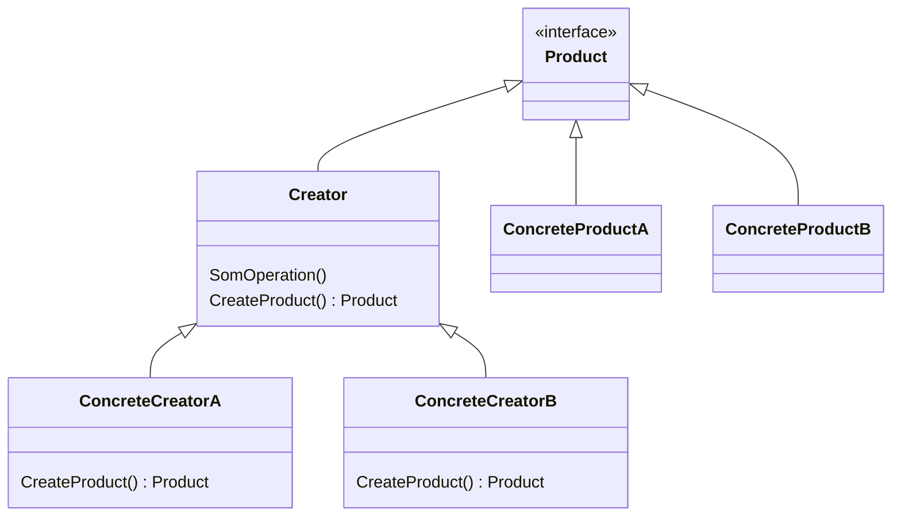

# Factory パターン
Decorator （デコレーター、 装飾器） は、 構造に関するデザインパターンの一つで、 ある振る舞いを含む特別なラッパー・オブジェクトの中にオブジェクトを配置することで、 それらのオブジェクトに新しい振る舞いを付け加えます。

## Factoryパターンのクラス図

```mermaid
classDiagram
class Creator
Creator: SomOperation()
Creator: CreateProduct() Product
class Product
class Creator
<<interface>> Product
Product  <|-- Creator
Creator  <|-- ConcreteCreatorA
Creator  <|-- ConcreteCreatorB
Product  <|-- ConcreteProductA
Product  <|-- ConcreteProductB
ConcreteCreatorA : CreateProduct() Product
ConcreteCreatorB : CreateProduct() Product
```

