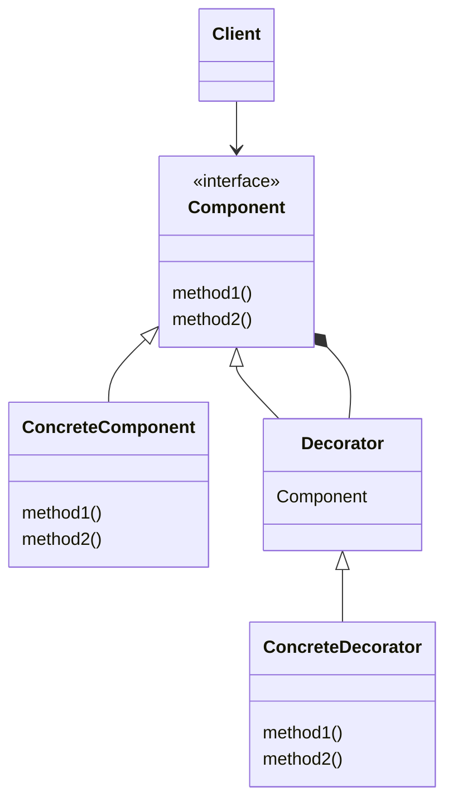
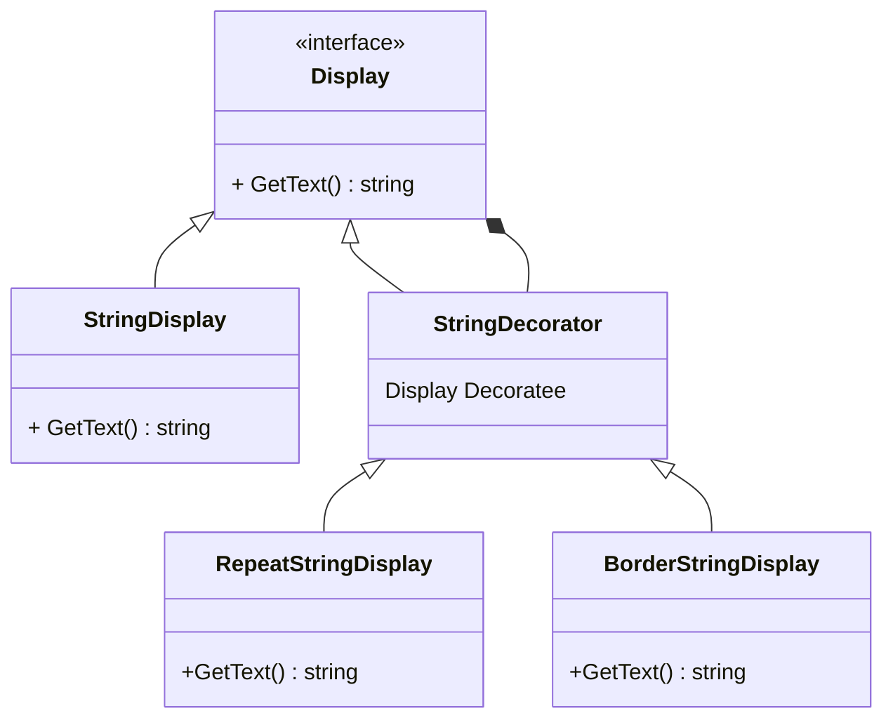

# Decorator パターン
Decorator （デコレーター、 装飾器） は、 構造に関するデザインパターンの一つで、 ある振る舞いを含む特別なラッパー・オブジェクトの中にオブジェクトを配置することで、 それらのオブジェクトに新しい振る舞いを付け加えます。

## Decoratorパターンのクラス図

### Decorator の役割り
1. Component(部品)
機能追加の核となるクラスです。機能拡張するメソッドのインタフェースを定義します。
1. ConcreteComponent(具体的な部品)
「Component」のインタフェースを実装します。基本となる機能を実装します。
1. Decorator(装飾者)
「Component」を実装しているオブジェクトを保持します。「Component」のインタフェースを受流し、サブクラスに実装させます。
※ 保持対象となるのは、「ConcreteComponent」「ConcreteDecorator」になります。
1. ConcreteDecorator(具体的な装飾者)
「Decorator」のインタフェースを実装します。
1. Client(依頼者)
「Decorator」パターンを適用したクラスを利用し処理します。

## サンプルコードの解説
Decorator パターンの説明のため、文字列表示の機能を実装します。

### 実装クラス

#### Displayクラス(Component)
各コンポーネントに共通のインタフェースを定義します。  
この例の場合、GetText()で文字列を返すこと、になります。  

#### StringDisplayクラス(ConcreteComponent)
「装飾の対象となるクラス」あるいは「元々存在していたクラス」です。  
基本となる機能を実装します。  
Decoratorによって機能が追加されます。  

#### StringDecoratorクラス(Decorator)
各ConcreteDecoratorの親となるクラスです。  
Componentのインスタンス(機能追加対象)を保持しています。  

#### RepeatStringDisplayクラス、BorderStringDisplay(ConcreteDecorator)
RepeatStringDisplayは「指定回数だけ文字列を繰り返す」という機能を追加します。  
BorderStringDisplayは「指定文字を文字列の前後に追加する」という機能を追加します。  
これらのDecoratorは多重に適応することができ、適応順により効果も変化するという特徴があります。  

