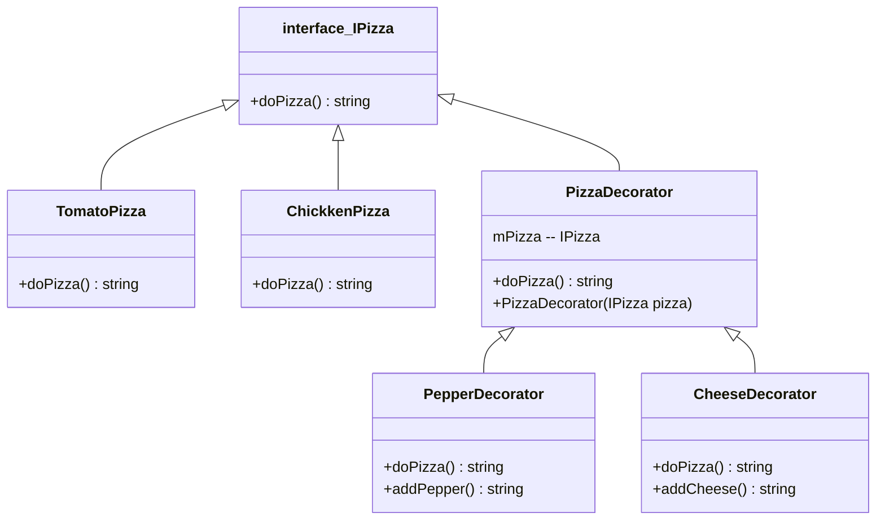

# Decorator パターン
Decorator パターンとは「装飾者」を意味します。
このパターンは、源となるオブジェクトに、機能という飾り付けをどんどん被せていき、要求にあうオブジェクトに仕立て上げていくパターンです。また、飾り枠と中身を同一視することでより柔軟な機能拡張方法を提供します。

## Decorator パターンの仕組み
Decorator パターンの説明のため、例のテーマは「Pizza」にします。

1. IPizza インターフェイスは、Decorator デザイン パターンのコンポーネントです。
2. TomatoPizza と ChickenPizza は IPizza の実装です (ConcreteComponent )。これらは、基本となる機能を実装します。
3. PizzaDecorator は、上記の設計図の中心です。TomatoPizza や ChickenPizza のピザの既存のインスタンスを保持します。このプロパティは ctor メソッドによって設定され、プログラムの実行中に展開されます。
4. PepperDecorator と CheeseDecorator は拡張メソッドを実装します。この例では、PepperDecorator は既存のピザにコショウを追加します。拡張機能は addPepper() メソッドに実装されています。

