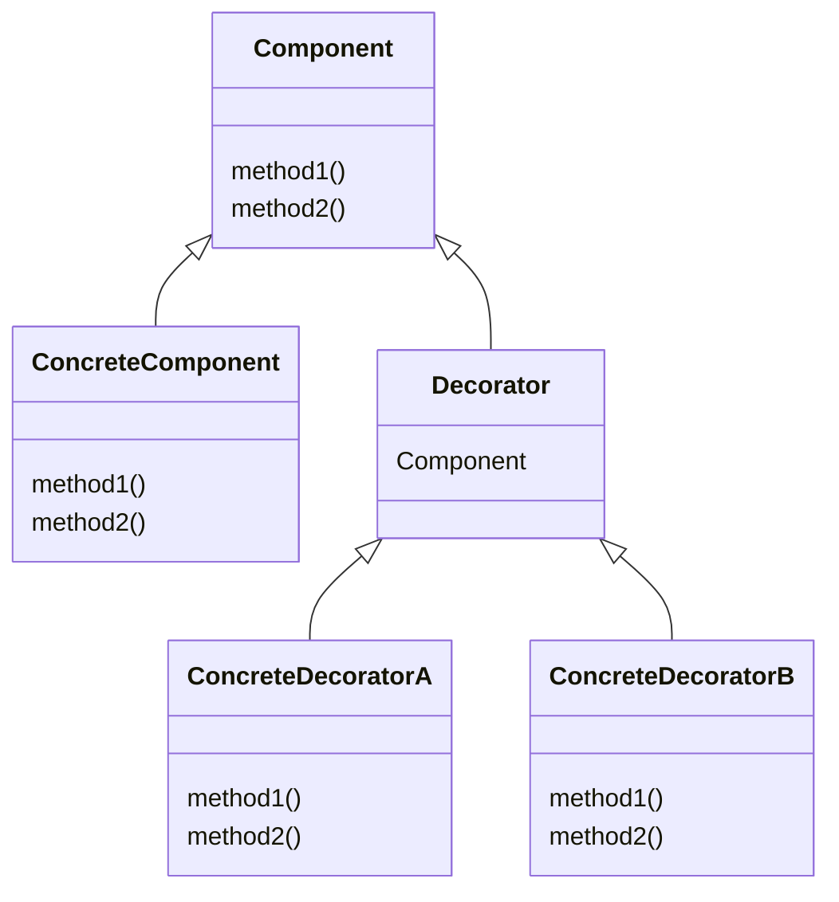
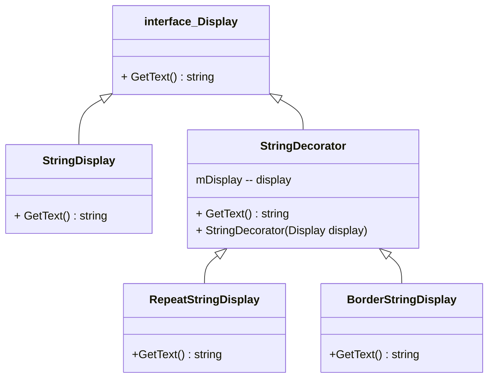

# Decorator パターン
Decorator （デコレーター、 装飾器） は、 構造に関するデザインパターンの一つで、 ある振る舞いを含む特別なラッパー・オブジェクトの中にオブジェクトを配置することで、 それらのオブジェクトに新しい振る舞いを付け加えます。

## Decoratorパターンのクラス図

### Decorator の　役割り
1. Component(部品)
機能追加の核となるクラスです。機能拡張するメソッドのインタフェースを定義します。
2. ConcreteComponent(具体的な部品)
「Component」のインタフェースを実装します。基本となる機能を実装します。
3. Decorator(装飾者)
「Component」を実装しているオブジェクトを保持します。「Component」のインタフェースを受流し、サブクラスに実装させます。
※ 保持対象となるのは、「ConcreteComponent」「ConcreteDecoratorA・B」になります。
4. ConcreteDecoratorA・B(具体的な装飾者)
「Decorator」のインタフェースを実装します。
5. Client(依頼者)
「Decorator」パターンを適用したクラスを利用し処理します。

## Decorator パターンの仕組み
Decorator パターンの説明のため、例のテーマは「Display」にします。

1. Display インターフェイスは、Decorator デザイン パターンのコンポーネントです。
2. StringDisplay  は Display の実装です (ConcreteComponent )。これらは、基本となる機能を実装します。
3. StringDecorator は、上記の設計図の中心です。StringDisplayの既存のインスタンスを保持します。このプロパティは ctor メソッドによって設定され、プログラムの実行中に展開されます。
4. RepeatStringDisplay と BorderStringDisplay は拡張メソッドを実装します。

