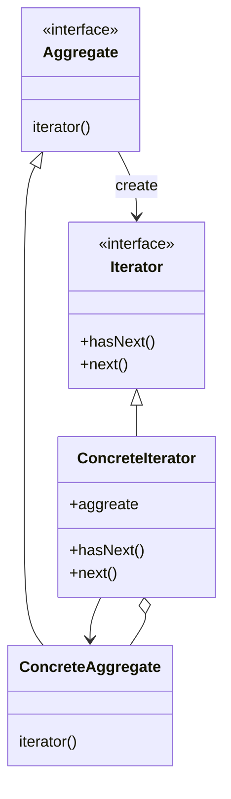
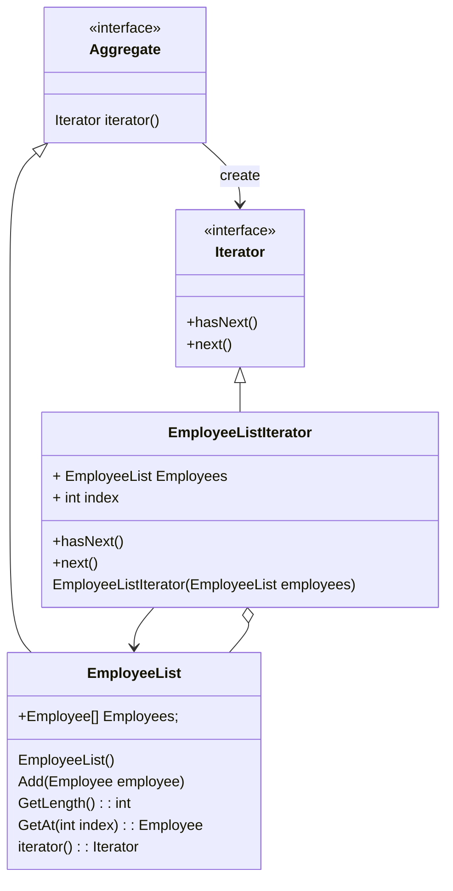

# Iterator パターン 
集約オブジェクトを内包するオブジェクトが内部表現を公開することなく, その要素に順にアクセスする方法を提供する
## Iteratorパターンのクラス図

### Iterator の　役割り
1. Iterator (反復子):
 - 要素に順次アクセスするインタフェースを定める.
2. ConcreteIterator (具体的な反復子):
 - [Iterator] が定めたインタフェースを実装する. 順次アクセス方法, 次要素の有無などの手順の詳細処理を定義する. また, 上記処理の対象となるオブジェクト (ConcreteAggregate) を生成時 (コンストラクタ処理) に保持しておく.
3. Aggregate (集合体):
 - [Iterator] を作り出すインタフェースを定める.
4. ConcreteAggregate (具体的な集合体):
 - [Aggregate] が定めたインタフェースを実装する. [Iterator] メソッドで, 自身のオブジェクトをコンストラクタ引数に [ConcreteAggregate] のオブジェクトを返す.
5. Item (集合体の各要素):
 - 集合体の要素.
6. Client (利用者):
 - [Iterator] パターンを適用したクラスを利用し処理する.
## 具体例
具体例として、「従業員をまとめる従業員リスト」と「従業員リストのIterator」をもとに説明します。

### 実装クラス
#### Employeeクラス
Employee(従業員)クラスは集合体の要素を表します。
名前と従業員コードを持ちます。
#### EmployeeListクラス
EmployeeList(従業員リスト)クラスは従業員の集合体を表します。
従業員の配列と添え字を持ちます。
iterator()において自身を引数としてEmployeeListIteratorを生成して返しています。
#### EmployeeListIteratorクラス
EmployeeListIterator(従業員リストIterator)クラスは従業員の集合体を数え上げるものを表します。
従業員リストと添え字を持ちます。
hasNext()で従業員リストが次の要素を持つかを確認し、next()で従業員リストの次の要素(従業員)を返却しています。 

